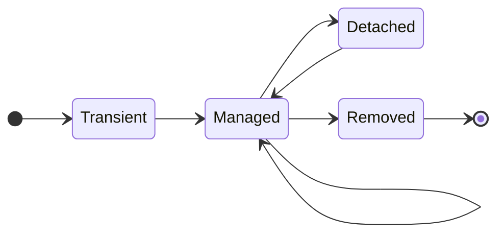

# Entity lifecycle — label the arrows (deliverable)

An entity object is always in one of **four states**. The arrows are the operations
that move it between them. The diagram below has the states but **unlabelled arrows** —
label each one with an operation from the word bank.

## Word bank — place each on exactly one arrow

- `new` (constructor)
- `persist` / `save`
- `merge`
- `remove` / `delete`
- `commit` / `close` / `clear` / `evict`
- `field change` → **UPDATE at flush** (the self-loop on *Managed*)
- `flush` → **DELETE**

## Questions to answer with your four

1. In which state does a `new` object start, and does creating it touch the database?
2. Which state means "Hibernate is watching this object and will write my changes at
   flush, even without `save()`"?
3. What moves a **managed** object to **detached**? Once detached, what happens to
   later field changes?
4. Which operation brings a **detached** object back under management?

> Tie this back to the prediction sheet: the self-loop on *Managed* is exactly what
> makes line 4 (a field change with no `save()`) reach the database at commit.
