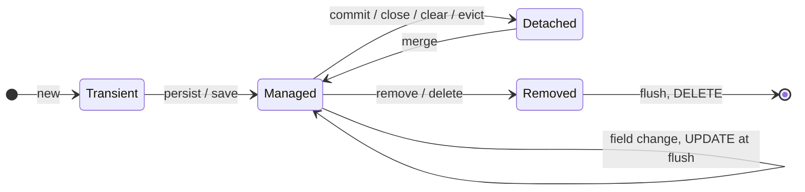

# Teacher key — introduction to JPA

Answers for the prediction sheet and the lifecycle diagram, plus the points to make in
the debrief. **Not for distribution.**

> **Verified** against Spring Boot 3.4.5 / Hibernate 6.6 on H2 (JDK 21). Captured
> statements: line 2 `insert into products ...`; line 5 `update products set name=?
> where id=?`; line 7 `select ... from products where id=?` then `update products set
> name=? where id=?`. Lines 1, 3, 4, 6 emit nothing.

## Prediction sheet — filled

| Line | What the line does | SQL? | Which | When / why |
|------|--------------------|:----:|-------|------------|
| 1 | `new Product("FM Radio")` | **N** | — | **transient** — `new` builds a Java object; the database knows nothing about it |
| 2 | `save(product)` | **Y** | `insert` | **at `save()`** — the id uses `IDENTITY`, so Hibernate must insert *now* to obtain it. The object is now **managed** |
| 3 | `findById(product.getId())` | **N** | — | the object is already managed; `find` by id returns the **same instance** from the persistence context — a cache hit, **no `SELECT`** |
| 4 | `found.setName("DAB Radio")` | **N** | — | marks the managed entity **dirty**; nothing is sent yet |
| 5 | method returns → **commit** | **Y** | `update` | **at commit → flush**; Hibernate's dirty check writes the change **without any `save()` call** |

**Totals:** 1 `insert`, 0 `select`, 1 `update` = **2 statements**.

**Line 3 identity:** `found` **is** the same object as `product` (`found == product` is
`true`). Because it is already managed, `find` hands back the in-memory instance, so no
`SELECT` runs.

### Bonus — detached

| Line | What the line does | SQL? | Which | When / why |
|------|--------------------|:----:|-------|------------|
| 6 | `product.setName("Retro Radio")` | **N** | — | `product` is **detached**; nothing is watching it, so the change lives only in memory |
| 7 | `save(product)` on the detached entity | **Y** | `select` then `update` | `save()` on a detached entity **merges** it: Hibernate loads the current row (`SELECT`), copies the change in, and writes it (`UPDATE`) in `save()`'s own transaction |

## Lifecycle diagram — labelled



The self-loop on **Managed** is the heart of the session: a field change on a managed
entity becomes an `UPDATE` at flush, with no `save()` — that is exactly line 4 → line 5.

## When SQL fires, on a transaction timeline

```mermaid
sequenceDiagram
    autonumber
    participant App
    participant PC as Persistence context
    participant DB
    App->>PC: new Product  (transient)
    App->>PC: save()  → managed
    PC->>DB: INSERT  (IDENTITY id needed now)
    App->>PC: findById(id)
    Note over PC: same instance — no SELECT
    App->>PC: setName  (marks dirty)
    Note over PC: no SQL yet
    App->>PC: commit
    PC->>DB: UPDATE  (flush; no save called)
```

## Debrief — the points to land

1. **Managed means Hibernate is watching.** Changes to a managed entity are written at
   flush without `save()`. This is the single most surprising idea for newcomers.
2. **`find` by id is a context hit.** No `SELECT` at line 3 because the object is
   already managed and identity is guaranteed within a persistence context.
3. **"When" usually means at flush/commit,** not at the line where you called the
   setter.

## Two nuances worth naming (not required of students today)

- **Id strategy changes the *timing* of the insert.** With `IDENTITY` (this listing)
  the `INSERT` must run at `save()` to get the id, so you see `INSERT` then a separate
  `UPDATE`. With `SEQUENCE`/`TABLE`, `save()` only reserves an id and the `INSERT` is
  deferred to flush — the line-4 change would fold into a **single `INSERT`** at commit,
  with **no** separate `UPDATE`. Same lifecycle, different statement count.
- **A query forces a flush.** Running a JPQL/derived *query* mid-transaction
  auto-flushes pending changes first, so the query sees them. The listing deliberately
  uses `findById` (a context hit, not a query) *before* the change, so this doesn't
  arise in the base case — but it is the mechanism behind "when" for queries, and it
  returns in activity 04 (N+1).

## Common wrong predictions to watch for

- Expecting a write at **line 4** (the setter) rather than at **commit**.
- Expecting a **`SELECT`** at line 3.
- Believing the line-4 change **won't persist** because `save()` was never called.
